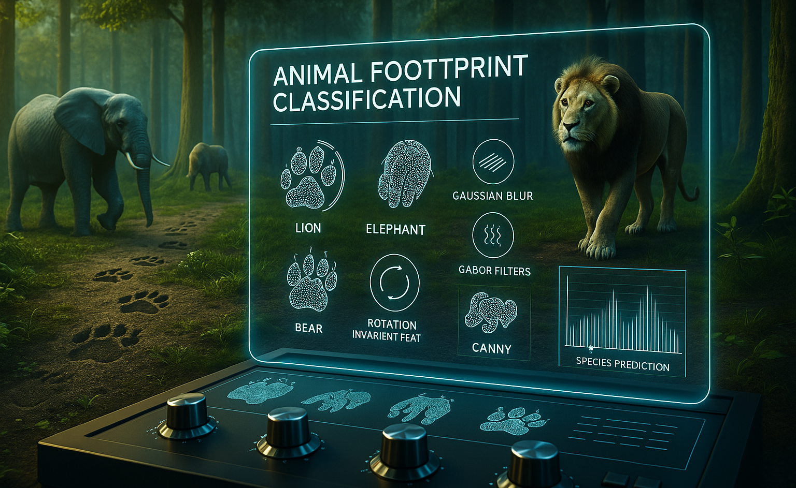
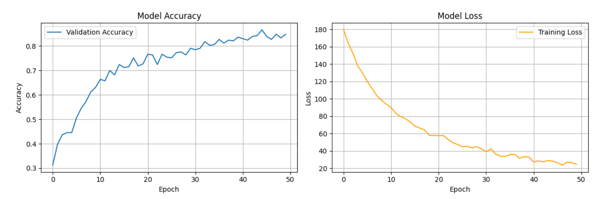

# WildPaw: Animal Footprint Classification with CNN

  

## Overview
"WildPaw" is a deep learning-based project that classifies animals based on their footprint images using a Convolutional Neural Network (CNN). It supports wildlife monitoring, biodiversity research, and smart farming by identifying animals from their footprints. The model is robust to various footprint orientations and includes a UI-based feature that categorizes animals as Safe or Unsafe. A lightweight Flask app is also included for simplified interaction and safety categorization.

## Features
- Footprint classification using CNN.
- Handles image preprocessing: resizing, normalization, rotation, and flipping.
- Rotation-invariant CNN architecture.
- Provides confidence scores for predictions.
- UI-based Safe/Unsafe category classification (not part of the trained model).
- Flask app integration for web-based predictions with safety labels.

## Class Distribution

| Class     | Count | Class     | Count |
|-----------|-------|-----------|-------|
| Bear      | 50    | Deer      | 50    |
| Bobcat    | 50    | Horse     | 50    |
| Fox       | 50    | Lion      | 50    |
| Mouse     | 50    | Wolf      | 50    |
| Racoon    | 50    | Squirrel  | 50    |

## How It Works
1. **Input:** A grayscale footprint image.
2. **Preprocessing:** Resize to 128x128, normalize, and augment with random rotations and flips.
3. **Model Prediction:** CNN model predicts the animal class based on learned features.
4. **Safe/Unsafe Categorization:** The UI and Flask app label the predicted class as Safe or Unsafe using predefined logic.

## Safe and Unsafe Classification (UI-Based)
After prediction, the animal is classified into a safety category using hardcoded logic in the interface:

| Animal    | Category |
|-----------|----------|
| Bear      | Unsafe   |
| Bobcat    | Unsafe   |
| Deer      | Safe     |
| Horse     | Safe     |
| Fox       | Unsafe   |
| Lion      | Unsafe   |
| Wolf      | Unsafe   |
| Mouse     | Safe     |
| Squirrel  | Safe     |
| Racoon    | Safe     |

This classification is not part of the trained model but handled in the Flask and Tkinter interfaces.

## Model Training
- Custom CNN with convolutional, batch normalization, dropout, and pooling layers.
- Data augmentation for generalization.
- Model checkpointing and early stopping during training.
- Trained in Google Colab with the best model saved as `best_footprint.pth`.

  

## Classification Report

| Class      | Precision | Recall | F1-Score | Support |
|------------|-----------|--------|----------|---------|
| Bear       | 0.83      | 0.81   | 0.82     | 31      |
| Bobcat     | 0.76      | 0.91   | 0.83     | 34      |
| Deer       | 0.88      | 0.74   | 0.81     | 31      |
| Fox        | 0.76      | 0.78   | 0.77     | 32      |
| Horse      | 0.97      | 0.97   | 0.97     | 33      |
| Lion       | 0.94      | 0.80   | 0.87     | 41      |
| Mouse      | 0.90      | 1.00   | 0.95     | 36      |
| Racoon     | 0.78      | 0.86   | 0.82     | 37      |
| Squirrel   | 0.78      | 0.78   | 0.78     | 23      |
| Wolf       | 0.89      | 0.78   | 0.83     | 32      |

**Overall Accuracy:** 85%  
**Macro Average:** Precision = 0.85, Recall = 0.84, F1 = 0.84  
**Weighted Average:** Precision = 0.85, Recall = 0.85, F1 = 0.85  

## Flask App Integration
A Flask-based interface is included in the project that:
- Receives the model's predicted class.
- Displays the animal name along with its safety status.
- Uses the same UI logic for Safe/Unsafe categorization as in the desktop version.

## Tools Used
- Google Colab for model development and training.
- Google Drive for dataset storage.
- OpenCV for image preprocessing.
- PyTorch for deep learning.
- Flask for web interface deployment.

## Dataset Access
You can access the dataset from the following Google Drive link:  
[Dataset Link](https://drive.google.com/drive/folders/1IRFHcBHRymxSG8y9d05uoPPB4NT8Ednj?usp=drive_link)

## Results
- Achieved 85% accuracy across 10 classes.
- High-confidence predictions on well-formed footprint images.
- Robust to variations in footprint orientation and visual obstructions.

## Applications
- Wildlife monitoring and research.
- Biodiversity tracking in natural reserves.
- Smart farming and animal intrusion detection.
- Educational tools for ecological studies.
- Assisting rescue and conservation teams in the field.
- Detects dangerous animals helping campers stay alert and make informed decisions in the wild.

## Contributing
Feel free to submit issues or pull requests for improvements.
